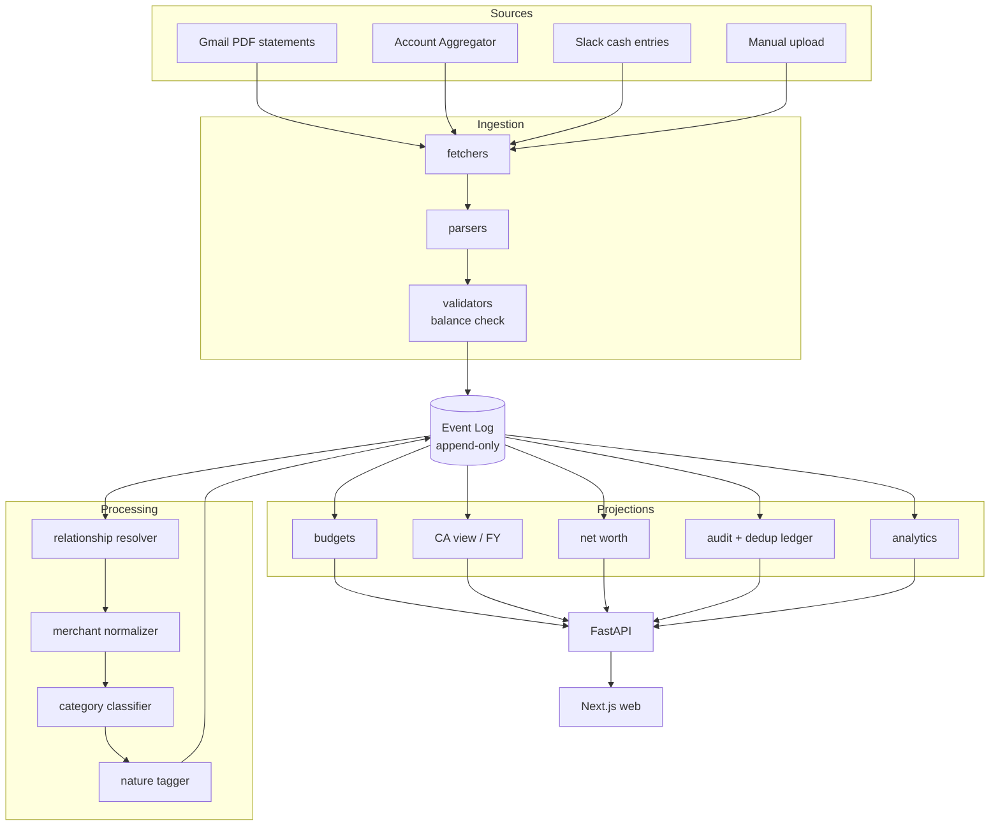

# Code Graph

> **Living document.** Update whenever module structure or dependencies change.
> Status legend: `[ ]` planned · `[~]` in progress · `[x]` built

**Last updated:** 2026-08-16 (Phase 2 complete; UI phases 2.5/3.5/4.5 added)

---

## 1. High-level dataflow



**Critical ordering:** `resolver → normalizer → classifier`. See `CLAUDE.md` §3.3. Reordering silently corrupts budget totals.

---

## 2. Module structure

```
backend/
├── core/
│   ├── events/          [x]    # event log primitives: append, read stream, encryption
│   ├── projections/     [x]    # projection builder + replay engine + snapshot
│   ├── hashing/         [x]    # idempotency hash, canonicalization, rounding
│   ├── models/          [x]    # mutable settings ORM (users, accounts, budgets)
│   └── ruleset/         [ ]    # FY-versioned tax rule sets — Phase 4
│
├── ingestion/
│   ├── api/             [x]    # FastAPI: POST /api/v1/statements/upload
│   ├── fetchers/
│   │   ├── pdf_reader/  [x]    # pdfplumber wrapper; PasswordRequiredError / PasswordIncorrectError
│   │   ├── gmail/       [ ]    # Gmail API, statement discovery — Phase 3
│   │   ├── aa/          [ ]    # Account Aggregator — deferred
│   │   └── slack/       [ ]    # cash entry bot — Phase 3
│   ├── parsers/
│   │   ├── base.py      [x]    # ParsedStatement, AbstractParser ABC, ParsedTransaction
│   │   ├── hdfc_cc.py   [x]    # HDFC Swiggy CC (extract_tables; Cr/Dr suffix)
│   │   ├── sbi_cc.py    [x]    # SBI CC (extract_tables; Cr/Dr suffix)
│   │   ├── hdfc_savings [x]    # HDFC Savings (extract_words + x-position bounding boxes)
│   │   ├── sbi_savings  [x]    # SBI Savings (extract_tables; opening balance from header)
│   │   ├── slice_savings[x]    # Slice Savings (regex; Rs./₹; apostrophe date)
│   │   └── llm_fallback/[ ]    # schema-constrained LLM extraction — Phase 3
│   ├── validators/      [x]    # balance check (Invariant 2); BalanceCheckResult
│   └── dryrun/          [x]    # dry-run harness + confirm + abandon + Redis session store
│
├── processing/
│   ├── resolver/        [x]    # 4 matchers + shared primitive + reducer + audit view
│   │   ├── config.py    [x]    # CC_PAYMENT_MATCH_WINDOW_DAYS, RESOLVER_CONFIDENCE_THRESHOLD
│   │   ├── events.py    [x]    # 4 resolver event payload schemas (Pydantic, frozen)
│   │   ├── candidate.py [x]    # CandidateTxn dataclass
│   │   ├── matching.py  [x]    # score_candidate_pair shared primitive
│   │   ├── reducer.py   [x]    # transactions_view reducer (registered with builder)
│   │   ├── audit.py     [x]    # build_audit_view → seen/counted dedup ledger
│   │   └── matchers/    [x]    # transfer, cc_payment, fd_booking, reversal
│   ├── accounts/        [~]    # GET /api/v1/accounts/{ref}/transactions — minimal Wave 4 E12 drill-down only; Phase 3.5 adds search/filters/pagination (PRD §4)
│   ├── normalizer/      [ ]    # merchant name cleanup — Phase 3
│   ├── classifier/      [ ]    # category assignment — Phase 3
│   └── nature/          [ ]    # essential/discretionary/luxury — Phase 3
│
├── domain/              [ ]    # Phase 3+
│   ├── budgets/         [ ]
│   ├── ca_view/         [ ]    # Phase 4
│   ├── networth/        [ ]
│   └── audit/           [ ]
│
├── adapters/
│   ├── llm/             [ ]    # provider-agnostic — Phase 3
│   └── storage/         [ ]
│
└── api/                 [~]    # ingestion endpoint live; budget/CA routes Phase 3+

tests/
├── unit/                [x]    # ~300 tests across core, ingestion, processing
├── property/            [x]    # Invariants 1, 2, 3, 4 (Hypothesis); 5, 6 Phase 4+
├── golden/              [x]    # 5 golden fixtures (HDFC CC, SBI CC, HDFC/SBI/Slice Savings)
└── fixtures/            [x]    # pdf_generator.py (fpdf2); dict_to_pdf_* for all 5 banks

web/                                # Next.js + TypeScript (strict). Phase 2.5+.
├── app/                 [ ]        # Next.js app router root
│   ├── layout.tsx       [ ]        # App shell: Expense ⇄ CA context switch, shared sidebar, bell
│   │
│   ├── (expense)/       [ ]        # Expense-context screens (sidebar swaps on context switch)
│   │   ├── page.tsx     [ ]        # Home / Dashboard §12A — pure visualization, 7 dashboards — Phase 3.5
│   │   ├── transactions/[ ]        # Transaction list + filter + detail §4 — Phase 3.5 (backend minimal at GET /api/v1/accounts/{ref}/transactions exists for E12 drill-down; full UI + search/pagination here)
│   │   ├── budgets/     [ ]        # Budget tracking §4.2 — Phase 3.5
│   │   ├── categories/  [ ]        # Category browse §4 — Phase 3.5
│   │   └── audit/       [ ]        # Audit index + 4 sub-views §15/§20.5 — Phase 2.5
│   │       ├── overlap-map/   [ ]  # Level A: statement-period overlaps per account
│   │       ├── dedup-ledger/  [ ]  # Level B: seen vs counted, traced to source
│   │       ├── pairings/      [ ]  # Resolver pairings — what matched and why
│   │       └── sync-history/  [ ]  # Per-account ingestion progress
│   │
│   ├── (ca)/            [ ]        # CA-context screens (sidebar swaps on context switch) — Phase 4.5
│   │   ├── tax-health/  [ ]        # FY dashboard §1
│   │   ├── fy-checklist/[ ]        # FY completeness §10
│   │   ├── advance-tax/ [ ]        # Advance-tax planner §1.7
│   │   ├── deductions/  [ ]        # Deductions §1.2
│   │   ├── capital-gains/[ ]       # Capital gains §1.3
│   │   ├── income-tds/  [ ]        # Income & TDS §1.1/§1.6
│   │   └── documents/   [ ]        # Document upload/manage
│   │
│   └── (shared)/        [ ]        # Context-independent screens, reachable from both contexts
│       ├── accounts/    [ ]        # Account management + add-account (dynamic parser path) §13 — Phase 3.5
│       ├── notifications/[ ]       # Full notifications view §18 — Phase 3.5
│       └── settings/    [ ]        # Global preferences §19 — Phase 3.5
│
├── components/          [ ]        # shadcn/ui copied primitives + custom wrappers (Phase 2.5+)
│   ├── ui/              [ ]        # shadcn/ui components: Button, Card, Badge, etc.
│   ├── money.tsx        [ ]        # IBM Plex Mono renderer; paise → ₹ Indian grouping (lakh/crore)
│   ├── kpi-tile.tsx     [ ]        # KPI strip tile: number + delta vs comparable period
│   └── time-selector.tsx[ ]        # Shared selector; all Home widgets subscribe to this single state
│
├── lib/
│   └── tokens/          [ ]        # CSS-variable token set (dark-first ink/navy; Phase 2.5)
│
└── public/

docs/design/                        # Visual reference — not source code, not under web/
└── wireframe-reference.html        # Interactive wireframe: all 13 screens, exact token values,
                                    # component patterns, interaction model (context switch,
                                    # audit drill-down filter, accordion). Reference only —
                                    # plain HTML/CSS, not React/shadcn. Translate to Next.js
                                    # + shadcn/ui following TRD §15.
```

---

## 3. Dependency rules

These are architectural constraints, not style preferences:

1. **`core/` depends on nothing.** It is the foundation — events, projections, hashing, rule sets.
2. **`ingestion/` and `processing/` depend on `core/`, never on each other's internals** and never on `domain/`.
3. **`domain/` reads projections. It never writes to the event log directly.**
4. **`api/` depends on `domain/`. Nothing depends on `api/`.**
5. **No vendor LLM SDK may be imported outside `adapters/llm/`.** The model is configuration.
6. **`web/` talks only to `api/`.** No direct DB access.
7. **UI widgets are pure functions of `(data, window)`.** The Home time-selector is a single screen-level state all widgets subscribe to. No per-widget date pickers. (TRD §15.4.)
8. **Theme is CSS-variable tokens only.** No hardcoded colors in any component. A theme change is a token-file swap, not a code change. (TRD §15.2.)

Violations of 1–4 create circular dependencies that make replay non-deterministic. Violation of 5 defeats the provider-agnostic decision (TRD T8). Violations of 7–8 produce screens that diverge in color/behaviour and cannot be re-themed without code surgery.

---

## 4. Module contracts

| Module | Contract | PRD/TRD ref | Status |
|---|---|---|---|
| `core/events` | Append event, read stream by aggregate. Append-only. Encryption per-user. | TRD §3.1 | `[x]` |
| `core/projections` | Build projection from event stream; deterministic replay; snapshot cache. | TRD §2.1, §3.3 | `[x]` |
| `core/hashing` | Idempotency hash, canonicalize_narration, compute_occurrence_index, rounding. | TRD §3.4 | `[x]` |
| `core/ruleset` | FY-pinned tax rule sets; closed FY never recomputes. | PRD §1.4, invariant 5 | `[ ]` Phase 4 |
| `ingestion/validators` | Balance check; reject-and-log on failure. Invariant 2. | PRD §14.2 | `[x]` |
| `ingestion/dryrun` | Parse preview without ledger write. Confirm writes. Abandon leaves nothing. | PRD §14.3 | `[x]` |
| `ingestion/parsers` | 5 per-bank parsers; all use shared `compute_occurrence_index()` (F-1). | PRD §14.1 | `[x]` |
| `processing/resolver` | 4 matchers + `transactions_view` reducer. Decisions recorded as events, never re-run at projection time. | PRD §7, TRD §9 | `[x]` |
| `processing/resolver/audit` | `build_audit_view` → seen/counted ledger with exclusion reasons. Level B (PRD §15). | PRD §15 | `[x]` |
| `domain/audit` | Full audit trail + dedup ledger (Level A overlap map). | PRD §15 | `[ ]` Phase 3 |

---

## 5. How to update this file

- When a module is created → flip `[ ]` to `[x]`, add its contract to §4.
- When a new dependency edge appears → check it against §3 first. If it violates a rule, that's a design problem, not a doc problem.
- When the dataflow changes → update the Mermaid diagram in §1.
