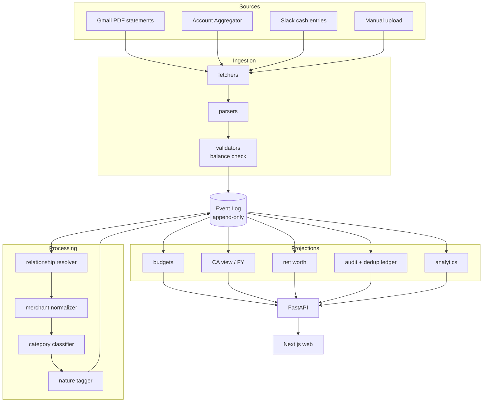

# Code Graph

> **Living document.** Update whenever module structure or dependencies change.
> Status legend: `[ ]` planned · `[~]` in progress · `[x]` built

**Last updated:** 2026-07-22 (Phase 0 — nothing built yet)

---

## 1. High-level dataflow



**Critical ordering:** `resolver → normalizer → classifier`. See `CLAUDE.md` §3.3. Reordering silently corrupts budget totals.

---

## 2. Planned module structure

```
repo/
├── CLAUDE.md
├── docs/
│   ├── PRD.md, TRD.md
│   ├── PROJECT_STATE.md, SESSION_LOG.md
│   ├── CODE_GRAPH.md, DECISIONS.md
│
├── backend/                        # Python + FastAPI
│   ├── core/
│   │   ├── events/          [ ]    # event log primitives: append, read stream
│   │   ├── projections/     [ ]    # projection builder + replay engine
│   │   ├── hashing/         [ ]    # idempotency hash (TRD §3.4)
│   │   └── ruleset/         [ ]    # FY-versioned tax rule sets (invariant 5)
│   │
│   ├── ingestion/
│   │   ├── fetchers/
│   │   │   ├── gmail/       [ ]    # Gmail API, statement discovery
│   │   │   ├── aa/          [ ]    # Account Aggregator (deferred)
│   │   │   └── slack/       [ ]    # cash entry bot
│   │   ├── parsers/
│   │   │   ├── templates/   [ ]    # deterministic per-bank layouts
│   │   │   └── llm_fallback/[ ]    # schema-constrained LLM extraction
│   │   ├── validators/      [ ]    # balance check (invariant 2)
│   │   └── dryrun/          [ ]    # dry-run harness (PRD §14.3)
│   │
│   ├── processing/
│   │   ├── resolver/        [ ]    # transfers, CC payments, FD (PRD §7)
│   │   ├── normalizer/      [ ]    # merchant name cleanup
│   │   ├── classifier/      [ ]    # category assignment
│   │   └── nature/          [ ]    # essential/discretionary/luxury (PRD §5)
│   │
│   ├── domain/
│   │   ├── budgets/         [ ]
│   │   ├── ca_view/         [ ]    # income, deductions, capital gains, etc.
│   │   ├── networth/        [ ]
│   │   └── audit/           [ ]    # audit trail + dedup ledger (PRD §15)
│   │
│   ├── adapters/
│   │   ├── llm/             [ ]    # provider-agnostic. NO vendor SDK outside here.
│   │   └── storage/         [ ]    # raw artifact store
│   │
│   └── api/                 [ ]    # FastAPI routes
│
├── web/                            # TypeScript + Next.js
│   ├── app/
│   │   ├── dashboard/       [ ]    # day-to-day (PRD §12.1)
│   │   ├── analytics/       [ ]    # (PRD §12.2)
│   │   ├── ca-view/         [ ]    # (PRD §1)
│   │   ├── accounts/        [ ]    # account management (PRD §13)
│   │   └── audit/           [ ]    # audit + duplication view (PRD §15.2)
│   └── lib/                 [ ]
│
└── tests/
    ├── unit/                [ ]
    ├── property/            [ ]    # invariant tests (CLAUDE.md §2)
    ├── golden/              [ ]    # synthetic statements + expected output
    └── fixtures/            [ ]    # synthetic generator. NO real data, ever.
```

---

## 3. Dependency rules

These are architectural constraints, not style preferences:

1. **`core/` depends on nothing.** It is the foundation — events, projections, hashing, rule sets.
2. **`ingestion/` and `processing/` depend on `core/`, never on each other's internals** and never on `domain/`.
3. **`domain/` reads projections. It never writes to the event log directly.**
4. **`api/` depends on `domain/`. Nothing depends on `api/`.**
5. **No vendor LLM SDK may be imported outside `adapters/llm/`.** The model is configuration.
6. **`web/` talks only to `api/`.** No direct DB access.

Violations of 1–4 create circular dependencies that make replay non-deterministic. Violation of 5 defeats the provider-agnostic decision (TRD T8).

---

## 4. Module contracts (fill in as built)

| Module | Contract | PRD/TRD ref | Status |
|---|---|---|---|
| `core/events` | Append event, read stream by aggregate. Append-only. | TRD §3.1 | `[ ]` |
| `core/projections` | Build projection from event stream; deterministic replay. | TRD §2.1, §3.3 | `[ ]` |
| `core/hashing` | Idempotency hash for transaction dedup. | TRD §3.4 | `[ ]` |
| `core/ruleset` | FY-pinned tax rule sets; closed FY never recomputes. | PRD §1.4, invariant 5 | `[ ]` |
| `ingestion/validators` | Balance check; reject-and-log on failure. | PRD §14.2 | `[ ]` |
| `ingestion/dryrun` | Parse preview without ledger write. | PRD §14.3 | `[ ]` |
| `processing/resolver` | Pair internal transfers/CC payments/FD; exclude from expense. | PRD §7 | `[ ]` |
| `domain/audit` | Seen-vs-counted dedup ledger; provenance per number. | PRD §15 | `[ ]` |

---

## 5. How to update this file

- When a module is created → flip `[ ]` to `[x]`, add its contract to §4.
- When a new dependency edge appears → check it against §3 first. If it violates a rule, that's a design problem, not a doc problem.
- When the dataflow changes → update the Mermaid diagram in §1.
